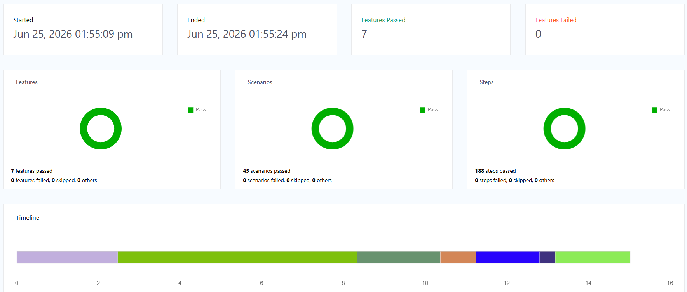

# API Testing Kata - Hotel Booking System

A REST API test automation framework built with **Java, REST Assured, Cucumber BDD and JUnit 5**.

## 🎯 Overview

This project demonstrates API testing best practices using the [Hotel Booking API](https://automationintesting.online/). It covers authentication, booking creation, retrieval, updates, and deletion with comprehensive test scenarios.

## 📌 Project Objectives

- Build a reusable and maintainable API automation framework.
- Validate hotel booking APIs using BDD and automated tests.
- Support parallel execution, reporting, and schema validation.
- Ensure code quality and scalability using industry best practices.

## 🛠 Tech Stack

- **Java 17** - Programming language
- **REST Assured 5.x** - API testing library
- **Cucumber 7.x** - BDD framework
- **JUnit 5** - Test execution framework
- **Maven** - Build and dependency management tool


## 📁 Project Structure

```
src
├── test
│   ├── java
│   │   └── com.booking
│   │       ├── client
│   │       ├── constants
│   │       ├── hooks
│   │       ├── models
│   │       ├── runner
│   │       ├── services
│   │       ├── stepdefinitions
│   │       └── utils
│   └── resources
│       ├── features
│       ├── jsonSchema
│       ├── spec
│       ├── config.properties
│       ├── extent.properties
│       └── junit-platform.properties
```
## 🔍 APIs Covered

- **Login Auth**  
  `POST /auth/login`

- **Create Booking**  
  `POST /booking`

- **Booking Details**  
  `GET /booking{id}`

- **Modify Booking**  
  `PUT /booking{id}`

- **Cancel Booking**  
  `DELETE /booking{id}`

- **Patch Booking**  
  `PATCH /booking{id}`


## 📊 Features Tested

- ✅ User authentication (login)
- ✅ Create booking
- ✅ Retrieve booking
- ✅ Update booking
- ✅ Partial update booking
- ✅ Delete booking
- ✅ End-2-End booking journey

## 🔍 Scenarios covered

- User logs in successfully with valid credentials
- User attempts login with different invalid credentials
- User attempts authentication using an unsupported operation
- User creates a hotel room booking successfully
- User creates a booking with invalid field values
- User creates a booking when checkout date is earlier than check-in date
- User creates bookings for different guest users
- User retrieves booking details using a valid booking ID
- User retrieves booking details using an invalid booking ID
- User attempts to retrieve a non-existing booking
- User updates an existing booking successfully
- User updates booking details with invalid data
- User partially updates selected booking details
- User cancels an existing booking successfully
- User cancels a booking using an invalid booking ID
- User attempts booking operations using unsupported HTTP methods
- User validates GET booking response against JSON schema
- User completes end-to-end booking flow successfully: creation, retrieval, update and cancellation

## 📋 Prerequisites

- Java 17 or higher
- Maven 3.8 or higher
- Git

## 🚀 Quick Start

### 1. Clone Repository

```bash
git clone <repository-url>
cd API_Testing_Kata
```

### 2. Install Dependencies

```bash
mvn clean install
```

### 3. Configuration

Edit `src/test/resources/config.properties` to customize:
- API base URL
- Authentication credentials

Edit `src/test/resources/junit-platform.properties` to customize:
- Parallel execution settings
- Thread count configuration

Edit `src/test/resources/extent.properties` to customize:
- Report generation settings
- Report output location
- Execution metadata

### 4. Run Tests

```bash
# Run all tests
mvn clean test

# Run specific feature
mvn test -Dcucumber.features="src/test/resources/features/auth.feature"

# Run by tag
mvn test -Dcucumber.filter.tags="@smoke"
```

## 📈 View Reports

After running tests, view reports:
- **ExtentReport:** `target/extend-reports d-MMM-YY HH-mm-ss/ExtentReport.html`
- **Cucumber Report:** `target/cucumber-reports/cucumber.html`

### Extent Report Dashboard



## 🔗 API Specification

- **Booking OpenAPI Spec:** `src/test/resources/spec/booking.yaml`

## 📝 Running Tests in IDE

### IntelliJ IDEA

* Right-click on feature file → "Run Feature"
* Right-click on TestRunner.java → "Run"
* Right-click on a Scenario or Tag → "Run"

## 🐛 Troubleshooting

**Tests not connecting to API?**

- Check internet connection
- Verify `base.url` in config.properties
- Ensure API is accessible: https://automationintesting.online

**Maven dependencies failing?**

```bash
mvn clean dependency:purge-local-repository install
```

**Java version not compatible?**

```bash
# Check version
java -version

# Ensure Java 17+ is installed
```

**Ready to test!** 🚀

```bash
mvn clean test
```

